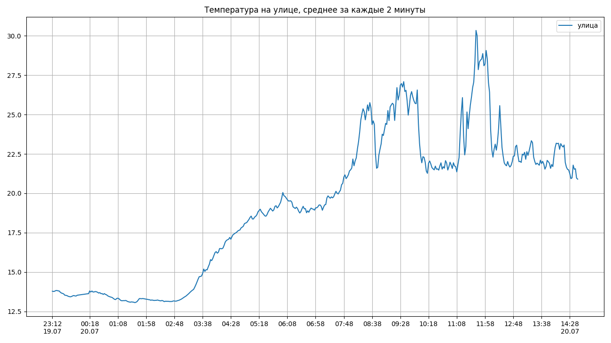
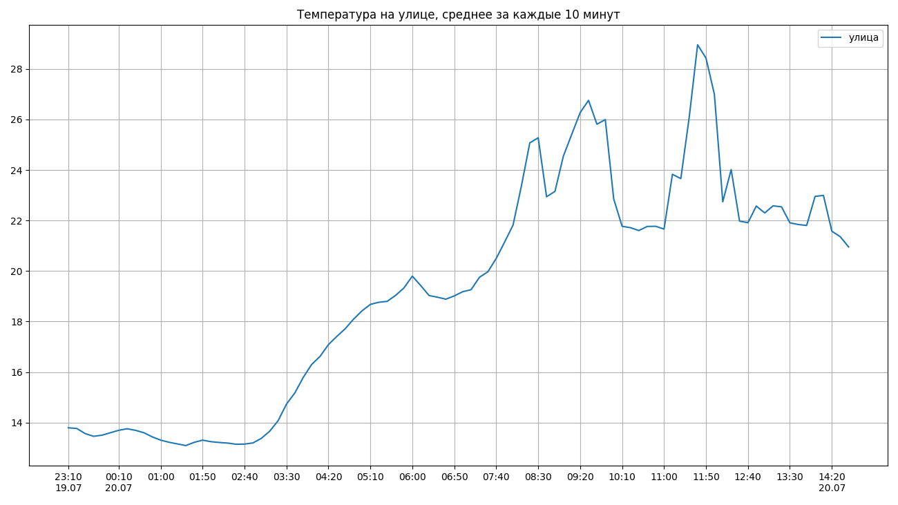
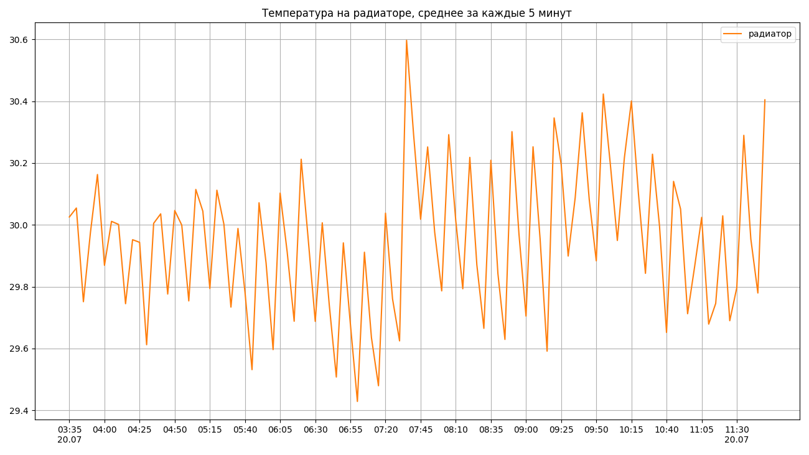
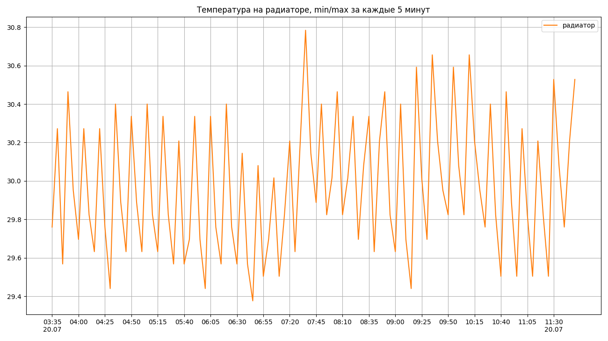

# Demonstration

Here's a quick demonstration that all of it actually works.

## Average

## Min-max

Min-max algorithm can be somewhat useful to see if there are some peaks and troughs, that averaging algorithm just cuts off:

